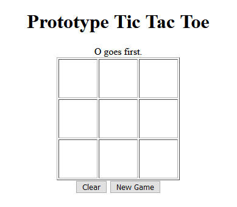
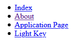
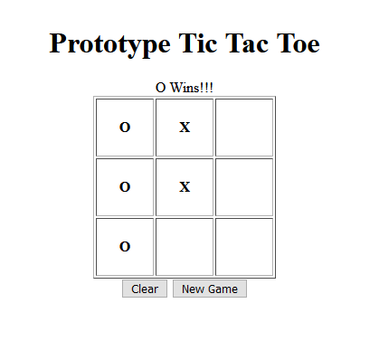
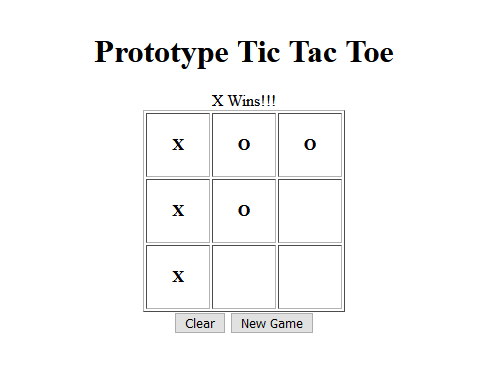
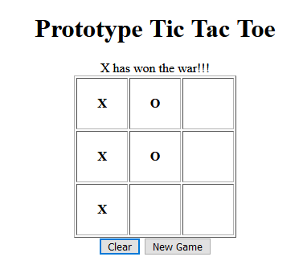

# SOFT166 Project: Tic Tac Toe

Application Demonstration Video: [Click Here](https://youtu.be/C3hBLoFHpNE)  
  
Application Fact Sheet: [Click Here](documents/SOFT166_TicTacToe.pdf)
  
#Application Screenshots
Standard Game:  

  
Menu:  

  
O Wins!!!:  

  
X Wins!!!:  

  
Winning the Game:  

  
#Web Accessibility Testing
I've gone over the initial requirements outlined in w3.org. While it doesn't show up in search engine results, its title is shown in the tab and web page.  
It also maintains an easy to use format as well as provides instructions should no one know how to play tic tac toe.